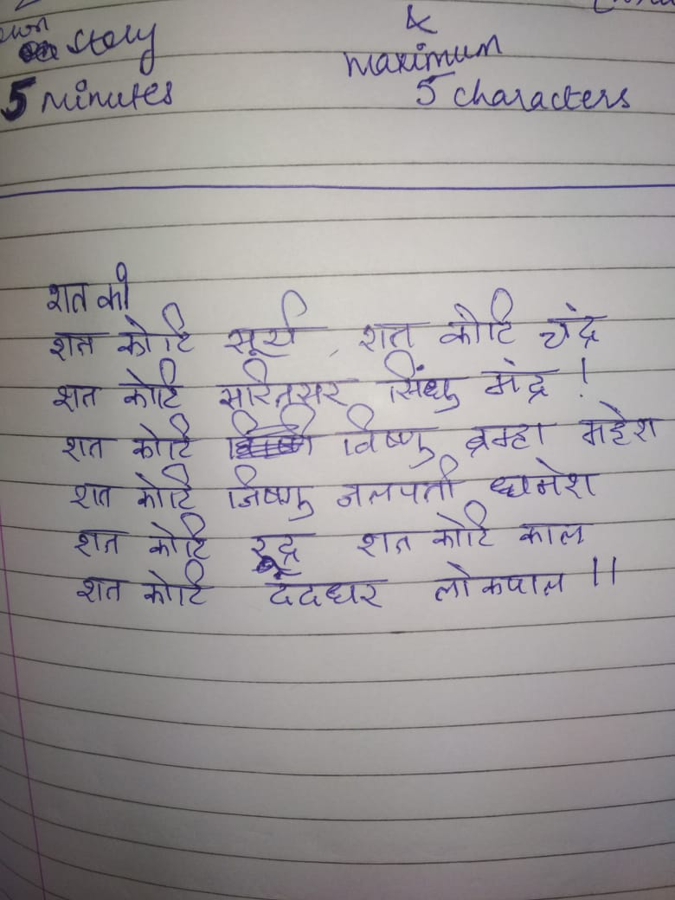

## 1-5 Lectures

### Introduction
>>Introduction of all students

### 5 W's
The 5 W's help the actor know more about the character.
>>Who
>>Where
>>Why
>>What
>>When

### Activities
Not to say any kind of negation during the play
>>An actor should never drown into the character but also should not be too concious about the crowd and the crew too.
>>Things should look natural

Complete a story in a group
Each person says a word or a sentence to make a story
>>Alertness and Imagination

### Homework
1. Learn tongue twister shlok in Sanskrit
        
2. Monolgue of 15 lines
3. Lip sync on a song
4. Sing a song
5. Write 2 plays
    3-5 characters 5 minutes

### Plays and Writers
1. Mohan Rakesh
    1. [Aashad Ka ek din]()
    2. Aadhe Adhure
    3. Lehroh k Rajhans

2. Vijay Tendulkar
    1. Khamosh adalat jaari hai
    2. Sakharam binder
    3. Jaate hi pucho sadhu ki

3. Baadal Sarkar
    1. Teesvi Satabdi
    2. Avam Indrajeet
    3. Baki Itihas

4. Girish Karnaad
    1. Tuglaq
    2. Agni Aur Barkha
    3. Hay vatan
